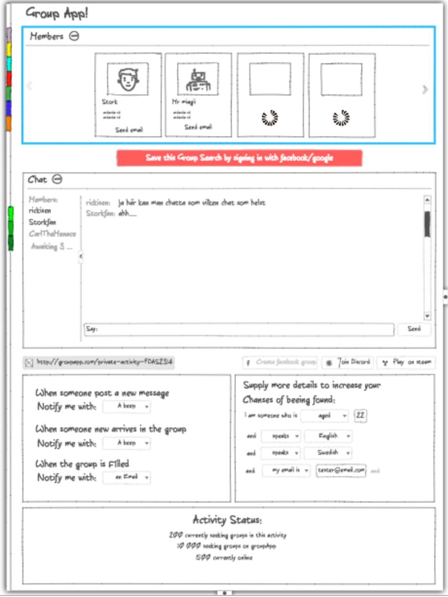

#1. Produktbeskrivning av GroupApp  

Idén till projektet grundar sig i ett vardagligt problem som uppstår när man försöker hitta vänner eller främmande människor till aktiviteter. Detta är något som ofta leder till jobbiga känslor hos folk och är ofta källan till många problem både på arbetsplatser, skolor, sport och i gaming-sammanhang. Vi kom fram till att den bästa metoden för att skapa grupper av folk är genom att låta folk själva specifiera vilka dom är och vad de söker. Vi ville skapa en webapplikation som ska låta en algoritm gå igenom allas egenskaper och krav och dela upp så bra grupper som möjligt.

Vi gick tillsammans igenom hur användaren mycket enkelt och smärtfritt skulle kunna ta sig igenom sidan. Det första vi gjorde var att skissa på mockups för vilka funktionaliteter som borde finnas. Någonstans under denna period kom vi också överens om att vi skulle göra detta i en MERN-stack.

###- Landing page

*På landningssidan planerade vi att det skulle finnas så lite som möjligt på. Snabba och okomplicerade fält som du fyller i.*  

**What field**  

I det första fältet matar du in precis det du vill göra. Du skriver in det i fritext och samtidigt söker vi igenom databasen för att hitta något som matchar det användaren matade in. Med hjälp av knapparna längst ut till höger kan du skapa väldigt specifika sökningar genom att länka ihop flera sökkriterier på samma gång.  
  
  
**With field**  

På den andra raden fyller du i vem du vill göra din aktivitet med. Du fyller i vad de andra ska vara för personer. Här kan du till exempel filtrera på ålder, kön, språk m.m. Här kan du också skapa en mycket specifik sökning beroende på hur många parametrar du länkar ihop.  
  
  
**I am field**  

Här skriver du i vem du är så att andra som söker någon med dina kriterier kan hitta dig. Samma sak gäller den här raden som de ovanför. Du kan länka ihop fler parametrar.  

**Docker Menu**  
På vänsterkanten ligger det en fixerad meny som högst upp har en "hem"-knapp. Under den ligger alla användarens gruppsökningar och de visas med en ikon och en titel. I botten av menyn ligger en footer som innehåller FAQ och About.

**- Magic Input**  

Här är ett exempel på hur det skulle se ut om man började fylla i aktivitetsfältet. Medan du skriver filtrerar vi det som skrivits in och försöker matcha det med aktiviteter som finns i databasen. De som matchar syns i en dropdown. Där kan du klicka på aktiviteterna för att automatiskt fylla i fältet. Finns inte aktiviteten ska du kunna skapa en egen aktivitet.

**Modal**  
När man klickar sig vidare för att skapa en sökning eller en aktivitet kommer det upp en modal där man kan välja att logga in eller att fortsätta utan att logga in men då måste man fylla i en captcha. Detta görs för att undvika spam.

###- Group

*Här är skissen på själva gruppen som du landar i efter att ha fyllt i dina sökkriterier. Det här är hjärtat av applikationen, det är här du träffar människor. Vi bestämde oss för att hålla designen uppdelad i massor av fritt flytande fyrkanter för att kunna hålla sidan så modulär som möjligt.* 

**Members**  

Högst upp ser man blocket “members”, det är där informationen om nuvarande gruppmedlemmar hamnar. Där visas bland annat namn, användarnamn och en profilbild. 
Många block har en minimeringsknapp för att kunna få bättre översikt över vilka block som finns på sidan.  

  
**Sign In**  

Den stora röda knappen visas endast om man sökt en grupp men inte loggat in. Med den ska man kunna spara sin gruppsökning till en inloggning. Trycker du på den har du möjlighet att logga in med antingen Facebook eller Google.
  
  
**Chat**  

Till vänster i chatten hamnar alla medlemmar och i den vänstra delen kan de nu hålla en konversation med varandra. 
  
  
**Share Line**  

Under chatten ligger det ett längre input fält med URL:en till just denna grupp så att man kan dela med sig av den. Användare som går in på länken hamnar i gruppen och har därifrån också möjlighet att logga in med Facebook eller Google.
  
  
**Share Buttons**  

Delningsknapparna är till för att kunna få folk att hålla ihop även utanför denna grupperingsapplikation. Har till exempel alla medlemmar i gruppen loggat in med facebook så kommer det upp en knapp för att skapa en grupp på facebook. Detsamma gäller Discord och Google groups m.m.
  
  
**Notification Settings**  

Här är det tänkt att du som användare själv ska kunna välja hur du vill bli notifierad om gruppen blivit full medan du gör annat. Söker du en grupp för någonting mer långsiktigt eller något väldigt specifikt kan det ta en lång stund innan du hittar medlemmar. Du skulle kunna bli notifierad med ett email eller ett ljud i webläsaren.
  
  
**Add Requirements**  

Går det inte hitta en grupp med de kriterierna du fyllt i ska du kunna ändra dem medan du är i gruppen. Ändrar du det skulle du kunna öka chansen att finna en grupp.
  
  
**Activity Status**  

Här får du en generell överblick på hela appen. Här skriver vi ut hur många som är inne, hur många som söker och hur många som letar grupper i en liknande kategori.

**Minimized Menu**  
Till höger ser man docker-menyn i sitt minimerade läge. För att maximera det dubbelklickar man på den.

###- Login

**Log In**  
Högst upp i hörnet på sidan finns en login knapp. När man trycker på den syns ett block med inloggningsalternativ. Du kan välja att logga in med Facebook eller Google. När man är inloggad sparas gruppsökningarna till personens profil i databasen.

###- Overview

*Denna vy är till för skaparen av gruppen så att personen får en överblick av grupperingen.*  

**Share Link**  

I fältet längst upp finns en länk som skaparen kan dela med sig av. Länken hänvisar till denna grupp och detta skulle till exempel kunna användas av en lärare så att klassen enkelt och snabbt blir uppdelad i flera grupper.  

**Grouping status**  

Här är ett block för att visa upp statistik med grafik på flera olika sätt.  

**Groups**  

I detta block syns alla medlemmar i alla grupper inom aktiviteten.

###- Customize

**Register Activity**  

Finns inte aktiviten du letar efter och klickar dig vidare till att skapa ny aktivitet hamnar du här. Första input-fältet väljer man en prefix och i det andra fältet själva namnet. Du kan välja om aktiviten ska vara privat eller öppen beroende på om du vill att folk ska kunna hitta aktiviteten i en sökning eller inte. Väljer du privat kan bara de du delar ut länkar till komma in på aktiviteten.

**Customize theme**  
Klickar du på "Customize Colors" får du upp ett nytt fönster. I det fönstret kan du ändra Headern och Bodyn på din aktivitet. Du kan ändra backgrundsbild, font, och färger.  

###Backend to Frontend - Data Flow

*Det här är en karta på hur dataflödet sker mellan frontend och backend som vi gjorde i slutet av vårt planeringsarbete.*